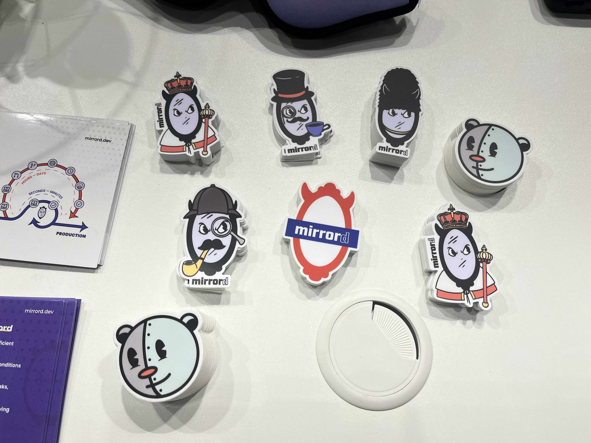
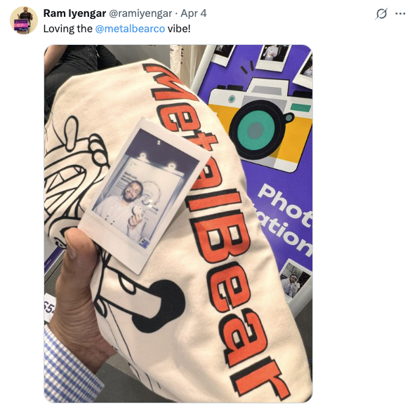
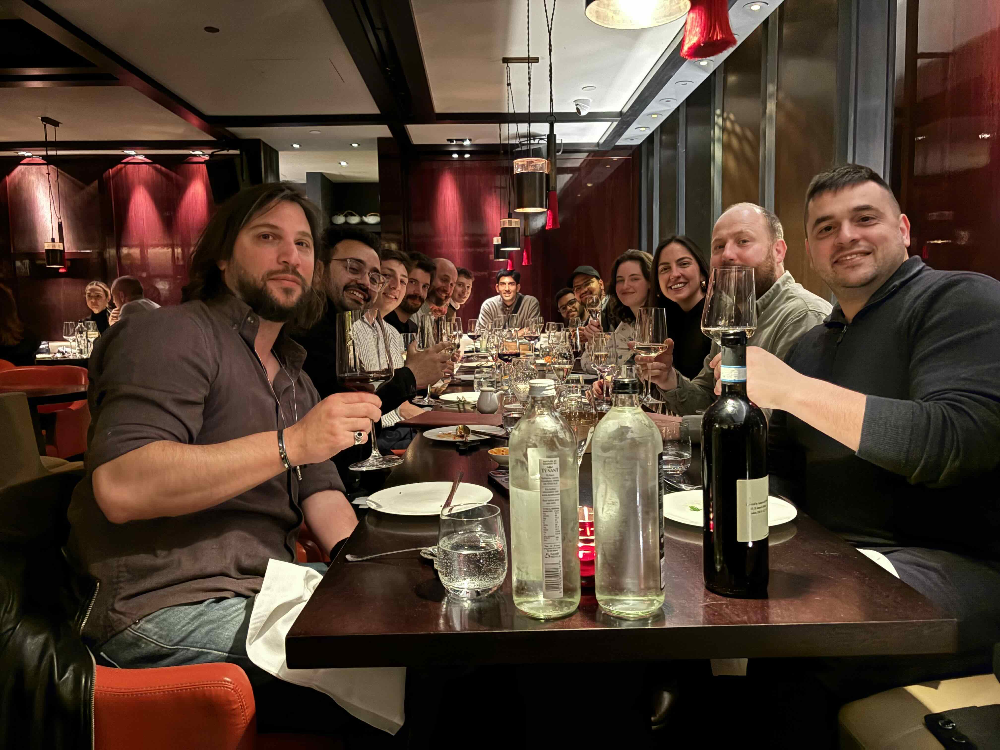

Earlier this month, the MetalBear team was in London for [KubeCon + CloudNativeCon EU](https://events.linuxfoundation.org/kubecon-cloudnativecon-europe/). This was our second time sponsoring the event, and it was an incredible few days of meeting developers, talking cloud native trends, and sharing the magic of [mirrord](https://metalbear.co/mirrord/?utm_source=blog&utm_medium=blog&utm_campaign=kubecon_london_blog).

If you couldn’t attend, we’ve got you covered. Here’s what stood out on the ground: what the buzz was about, the dev pain points people were talking about, and why [mirrord](https://metalbear.co/mirrord/product/?utm_source=blog&utm_medium=blog&utm_campaign=kubecon_london_blog) struck such a chord with so many teams.

## The Conference (and what it told us)

This year’s KubeCon was the biggest yet with over 13,000 attendees in person! From the energy in the hallway tracks to the overflown rooms during talks, it was clear the cloud native community is not slowing down.

One of the biggest advantages of being on the ground at KubeCon for us was hearing directly from people building and running cloud native systems every day. We recorded short interviews with CNCF Ambassadors and practitioners, and those conversations shaped a lot of what we took away from the event. A few themes kept coming up again and again.

### AI on Kubernetes

AI wasn’t just hype at this KubeCon. Teams shared how they’re adapting their Kubernetes clusters for LLM workloads, managing GPUs, and trying to keep costs under control.

Most of these teams aren’t building LLMs, they’re integrating them. And they’re realizing fast that traditional dev workflows break down when models are part of the stack. The complexity of running AI in cloud native environments is creating new pressure on testing and debugging workflows. Nobody has the complete playbook yet. There’s no single best practice or tool that fits all. Right now, it’s a collective effort. KubeCon was all about teams sharing what’s working, what’s not, and learning from each other. These conversations at KubeCon were less about "the answer" and more about accelerating the path to one.

### Observability is becoming a must have

OpenTelemetry came up in a lot of the conversations around production readiness. The general feeling we got from the conference was that teams are done flying blind.

Whether it’s tracing, unified metrics, or better dashboards, the appetite for visibility has exploded. And it’s not just ops folks asking for this anymore, developers want it too because they’re the ones getting paged when something breaks in prod.

The message was loud and clear: If your platform doesn’t offer insight, it’s falling behind. And that has ripple effects all the way back to local development, because you can’t fix what you can’t see.

### DX still needs work

One theme that stood out, especially from our interviews, was how much frustration still exists around documentation for different developer tools. Even with mature tools, documentation remains a major pain point for developers when trying to adopt them.

The full interviews we recorded should be out soon if you’re interested in knowing more details about what the community is thinking and where it’s heading. Follow us on [LinkedIn](https://www.linkedin.com/company/metalbearco/) to catch them when they’re out!

## The MetalBear Booth

We spent a lot of time at our booth, and it turned out to be one of the most insightful parts of KubeCon for us. 

What really stood out wasn’t just the volume of conversations, but the kinds of questions we kept hearing again and again. Almost every developer who stopped by was grappling with the same core frustration: *“How do I shorten my development loop without CI or staging being a bottleneck?”* That question alone sparked dozens of conversations about workflows, deployment struggles, and the tools teams are trying (and abandoning).

For us, it was incredibly energizing to see just how quickly the core idea behind [mirrord](https://metalbear.co/mirrord/?utm_source=blog&utm_medium=blog&utm_campaign=kubecon_london_blog) clicked with people, even those who hadn’t heard of it before. Once they understood that mirrord lets them run the code they’ve written locally in the context of a remote Kubernetes cluster, you could see that “aha” moment land. Suddenly, the problems they’d been working around for months had a clear path forward.

We also heard from plenty of folks already using mirrord in production. Many of them shared how it's helped them use staging environments much more effectively, debug faster, and build with more confidence. 

Our biggest takeaway from our time at the MetalBear booth was that the dev loop is still broken for many teams. CI remains a huge time sink, and developers are actively looking for ways to iterate faster without having to repeatedly go through the time consuming CI loop.

Also the MetalBear swag was a massive hit (again)! Our London themed stickers, t-shirts, sleeping masks, and stress balls flew off the table. We even ran out of some of the items mid-conference which is always a good problem to have 😄



<!--  -->

Other than that we also clicked polaroid photos of people who wanted as a memory for them to take home from KubeCon :)



<!--  -->

## Fun Highlights

Of course, KubeCon isn’t just about the technical talks and swag, it’s also about the moments that remind us how fun this community really is.

One particularly fun session we attended this time was KubeCon’s spin on the British TV game show "Family Fortunes". Two teams of four went competing against each other trying to guess the most popular answers to Kubernetes-themed survey questions, and let’s just say, the results were hilarious. If you’re up for a laugh, the [recording is well worth a watch](https://www.youtube.com/watch?v=2-fSMpCSYnw).

Evenings at KubeCon are just as vibrant as the days. Every night, the city came alive with parties and dinners. We hosted a dinner for MetalBear customers, giving us a chance to sit down face-to-face with some of our globally distributed users and share good food, stories, and plenty of Kubernetes banter.



<!--  -->

Other than that, we as a team also attended [Kuberoke](https://kuberoke.love/) which is a Karaoke party for the Kubernetes community! This was a really cool event too full of some good (and some not so good :P) covers of iconic songs.

## Stay in Touch

Cloud native development still feels messy, and it’s clear that teams are looking for better ways to move fast without breaking things. That’s why mirrord resonated so strongly with so many people at KubeCon: it helps developers test faster, debug with confidence, and skip the CI chaos.

If you’ve ever waited on CI just to validate a tiny change, or found yourself stepping on a teammate’s toes in a shared environment, [mirrord](https://metalbear.co/mirrord/?utm_source=blog&utm_medium=blog&utm_campaign=kubecon_london_blog) might be exactly what you’ve been missing.

We’ll be at [KubeCon NA](https://events.linuxfoundation.org/kubecon-cloudnativecon-north-america/) in Atlanta later this year, but until then, we’ve got a lot more to share. From community interviews to cloud native insights, we’ll be rolling out more of what we captured in London over the coming weeks. Follow us on [LinkedIn](https://www.linkedin.com/company/metalbearco/) to stay in the loop!
