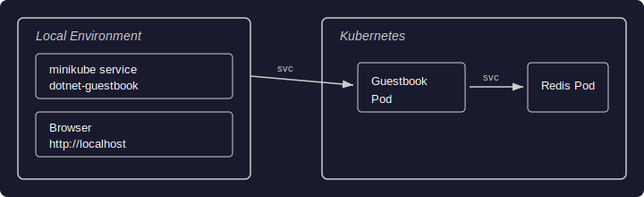
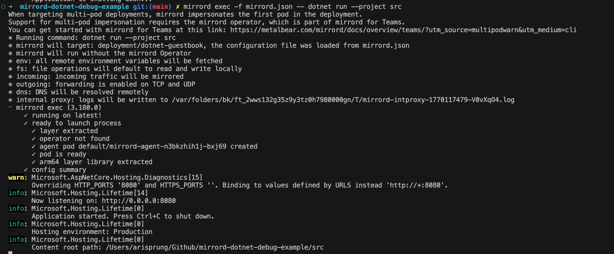
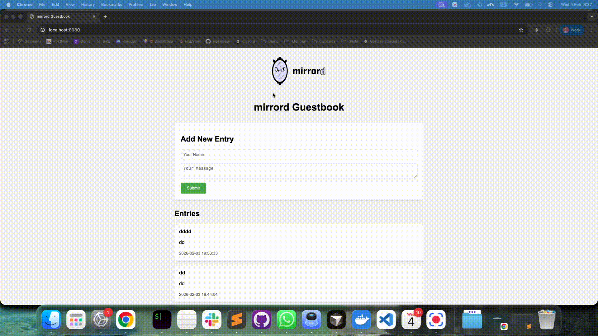

# How to Debug a .NET Microservice
In this guide, we'll cover how to debug a .NET microservice running in a Kubernetes environment using mirrord. You'll learn how to set up and use mirrord to debug .NET microservices in the command line.

Tip: You can use mirrord to debug, test, and troubleshoot your applications locally with Kubernetes context, without needing to build or deploy each time.

## Common debugging techniques for microservices in .NET
It can be cumbersome to debug microservices on Kubernetes. The lack of a debugging workflow for applications with multiple runtime dependencies in the context of Kubernetes makes it even harder. Why does it even make it harder? The following are common ways of debugging microservices with strict runtime environment dependencies:

### Continuous Deployment
Build a container image and deploy it to a Kubernetes cluster dedicated to testing or staging. The iterative process of building, deploying, and testing is resource-intensive and time-consuming, especially for testing frequent code changes.

### Log Analysis
One of the most common ways to understand the application behavior in a cluster is by analyzing logs. Adding extra logs to extract runtime information on the application is very common. Collecting and analyzing logs from different services can be effective but it isn't the best real-time debugging solution.

### Remote Debugging
Developers can use remote debugging tools built into IDEs like Visual Studio or JetBrains Rider to attach to processes already running in a Kubernetes cluster. While this allows real-time code inspection and interaction, it still requires heavy overhead from the IDE and a separate debug configuration for the deployment which can potentially affect the application's performance while debugging.

The above methods can be used by themselves or they can be used together.

## Challenges of debugging .NET microservices in Kubernetes
Debugging effectively within a Kubernetes context is the biggest challenge of working with Kubernetes. The build and release loop of the application can be short, but the process slows down development significantly. Nothing beats the ease and speed of debugging applications locally.

## Introduction to debugging .NET microservices with mirrord
With mirrord, we don't have to think of building and releasing our applications for debugging. We can run our applications locally, and mirrord will make sure to have your locally running process in the context of Kubernetes. Context mirroring for processes allows your process to run locally and consume the resources of a remote resource.

### Workload to process context mirroring
To achieve this, inputs from a Kubernetes workload (eg: a Pod) are mirrored to a locally running process. The process in question here today is a .NET process. Let's see how we can mirror inputs for our locally running .NET application using mirrord and pipe these outputs back to Kubernetes. This will create a tighter feedback loop effectively allowing you to debug faster without the downsides of the common debugging techniques we discussed above.

### Sample application setup
In the example below, our .NET application will run locally. It will need to have the network information and environment of a Kubernetes Pod to debug. This Kubernetes Pod is running as part of a staging application deployment and will be our mirroring target.

The sample application is a Guestbook built with ASP.NET Core and Redis. It stores guestbook entries in Redis and displays them on a web interface.

Let's get started with some prerequisites by setting up a test cluster and deploying our mirroring target.

### Prerequisites
Make sure you have the .NET 10.0 SDK (or higher) installed locally. You can download it from the [official .NET website](https://dotnet.microsoft.com/download).

Set up the Kubernetes cluster to test our application setup.

1. Start an instance of a development cluster like minikube, k3d, kind, etc. We are using minikube here.

```
minikube start
```

2. Clone the repo with the sample .NET application.

```
git clone https://github.com/aris-cub/mirrord-dotnet-debug-example
cd mirrord-dotnet-debug-example
```


3. Deploy our application which will act as our staging environment.

```
kubectl create -f ./kube

deployment.apps/dotnet-guestbook created
service/dotnet-guestbook created
deployment.apps/redis created
service/redis created
```


Once the above is deployed, our application architecture now looks like this:


- A `dotnet-guestbook` Deployment running an ASP.NET Core web server on port 8080
- A `redis` Deployment running Redis on port 6379
- A `dotnet-guestbook` Service (LoadBalancer) exposing the web server on port 80
- A `redis` Service exposing Redis on port 6379

We have our staging application deployed now. Let's run the microservice with mirrord next. This will allow us to run the local .NET application in the context of Kubernetes without having to build and deploy it over and over again for testing.

## Debug in the CLI with dotnet and mirrord
1. Run the application with dotnet in the CLI

Let's run the following command to check if the application fails to run...

```
dotnet run --project src
```


On the run above we can see that the application run fails because this local execution doesn't have access to the Redis instance running inside the Kubernetes cluster we have created.


The microservice needs access to the "redis" service hosted on the cluster. To run the .NET microservice with Kubernetes context, we can use the mirrord CLI tool.

2. Installing mirrord

Install the mirrord CLI tool and run Guestbook with the required Kubernetes context. Follow the installation guide for mirrord [here](/mirrord/docs/overview/quick-start/#installation).

3. Run the Guestbook application with dotnet and mirrord in the CLI

In a new terminal, run the following command to run the guestbook application in the context of Kubernetes.

```
mirrord exec -f mirrord.json -- dotnet run --project src
```

The `-f mirrord.json` flag points to the mirrord configuration file which specifies:
- The target deployment (`deployment/dotnet-guestbook`)
- Network settings: incoming traffic is mirrored, outgoing traffic and DNS resolution are forwarded to the cluster
- Filesystem mode is set to local

You should see the following output which will let you know that the guestbook has started in debug mode.



The target impersonated Pod here is the Guestbook Pod. mirrord allows the user to use the mirrord-agent Pod as the execution context.

mirrord mirrors traffic from the cluster to the locally running process.

The application will be available at http://localhost:8080.

After you have run the guestbook program with mirrord you should be able to make your changes and rerun the service as necessary. You can even run the program in debug mode and attach a debugger if required.

## Debug the Guestbook application with VSCode and the VSCode mirrord extension

In this section of the guide, we are going to use the VSCode mirrord extension to help debug the .NET application. If you would like to see how we can do the same in the CLI, go to this section of the guide.

The application in question is Guestbook, a simple note-taking app written in ASP.NET Core with support for storing notes in Redis. The source code for the test application is available on GitHub at https://github.com/aris-cub/mirrord-dotnet-debug-example . We will use it as a follow-along .NET application for debugging with mirrord.

## Setup VSCode with the mirrord extension

To get started, install mirrord in VSCode.

### Extension installation

You can install the plugin by searching for mirrord in the extensions.


After mirrord is installed, you will see a mirrord button in the bottom left corner of your VSCode instance.


### mirrord configuration

Let's add a new config file for mirrord, which we can use with VSCode for debugging. The configuration below contains the target deployment from where we need to mirror the context. 

```json

{
    "target": "deployment/dotnet-guestbook",
    "feature": {
      "network": {
        "incoming": "steal",
        "outgoing": true
       
      }
    }
  }


```


If you want to steal traffic from a multipod deployment, you can learn more about mirrord for teams /mirrord/docs/overview/teams/ which provides this feature. Right now, we only have one pod in this deployment, and mirrord's OSS features should work perfectly for us.

To ensure that the configuration file created is read by the VSCode mirrord extension, hover over the mirrord button we mentioned earlier and press the 'Select active config` option. From the given prompt, enter the location of the configuration to be consumed by the plugin.


Once the active configuration is selected, we can start using mirrord with VSCode.

## Run and Debug with and without mirrord in VSCode


Now let's use mirrord to mirror the context from Kubernetes to our locally running .NET application.

### Run and Debug with the mirrord plugin enabled


Enable the mirrord plugin by clicking on the mirrord button in the bottom left corner of the screen. The enabled button should look like the one below.


Before running the application ensure that the dependencies have been satisfied. After that, let's Run and Debug our application with mirrord first by selecting Run and Debug from the Run and Debug tab.


Upon choosing the .NET Pod as the target, you can see logs similar to the ones below with the .NET app, call stack and the terminal for debuggingstarting successfully. 


Once the app is running with the mirrord extension, access it on localhost:8080 in the browser. You will see the following UI to the mirrord guestbook application.


Now, let's debug the application with mirrord.

## Debugging the application with the mirrord plugin


We can now be sure that mirrord is working properly. 

Let's set a debug breakpoint in the application and see how it runs. I want to put a breakpoint in the application every time I create a note with the Guestbook application. The below line of code is where I am going to put the breakpoint.


From http://localhost:8080, try publishing a new entry to the guestbook, which would hit the debugging entry point.

You should hit the breakpoint as shown below:



We can debug the issue now as the breakpoint is hit.

You now know how to debug your .NET microservice with VSCode + mirrord without having to build and deploy your application anew.

## Debugging with mirrord vs. other debugging techniques

[mirrord](/mirrord/) distinguishes itself by eliminating the need for repeated building and deployment cycles. It allows developers to run the application locally while providing the necessary network and execution context of the target Kubernetes Pod. In this case, the local application behaves as if it were running within the cluster, enabling developers to debug using familiar tools without the overhead to build and deploy.

## Conclusion

This guide explored how to use mirrord in VSCode using the mirrord extension and the mirrord CLI. We demonstrated how developers can set breakpoints in their IDE or CLI debugger and step through code execution while leveraging the live Kubernetes environment.

By enabling local execution with Kubernetes context, mirrord helps developers save substantial time during debugging.

Curious to try it out? Give [mirrord](/mirrord/) a go and see how it works for you. Got questions? Hop into our [Slack](https://metalbear.com/slack) and let us know!
