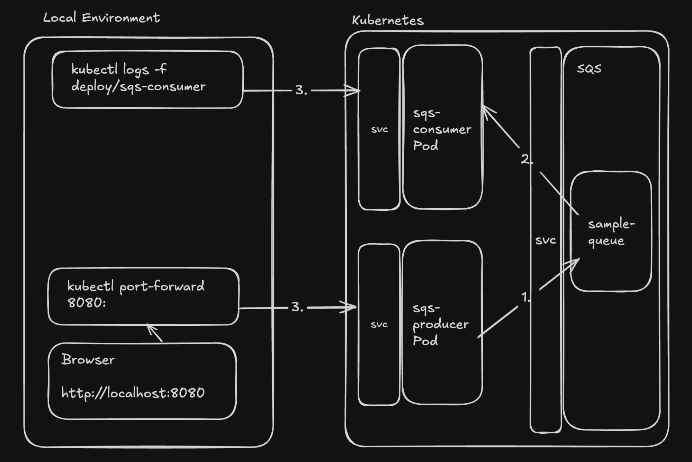
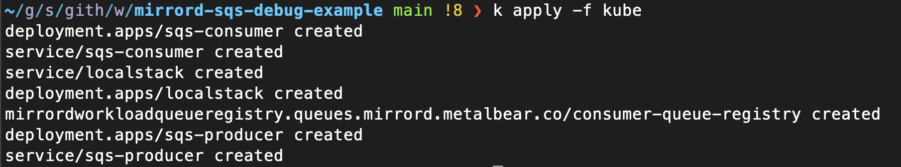
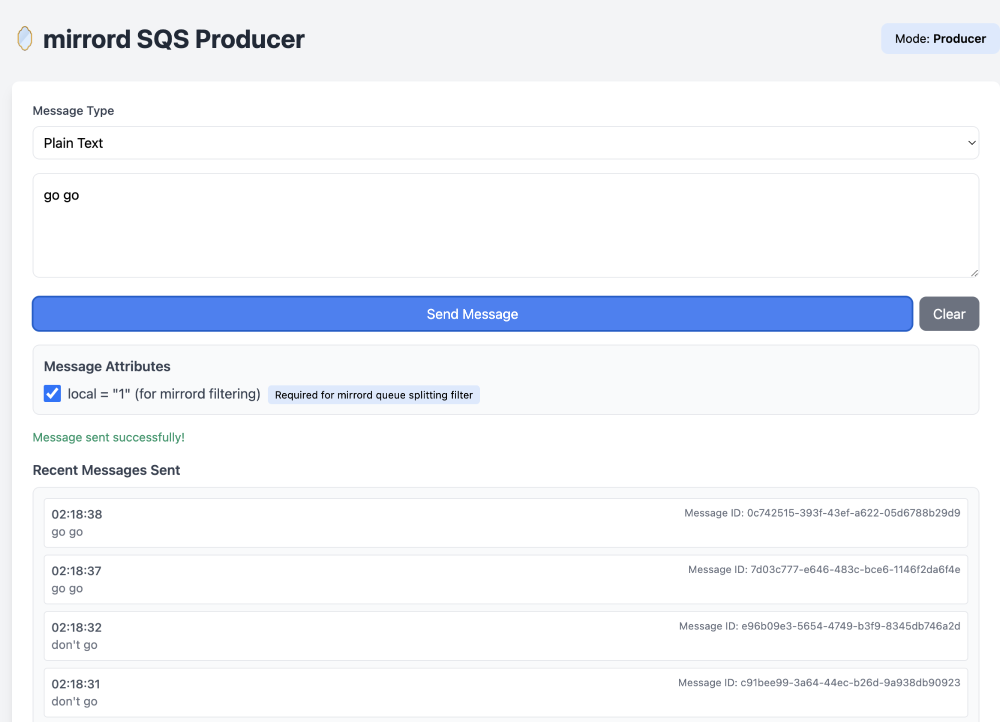
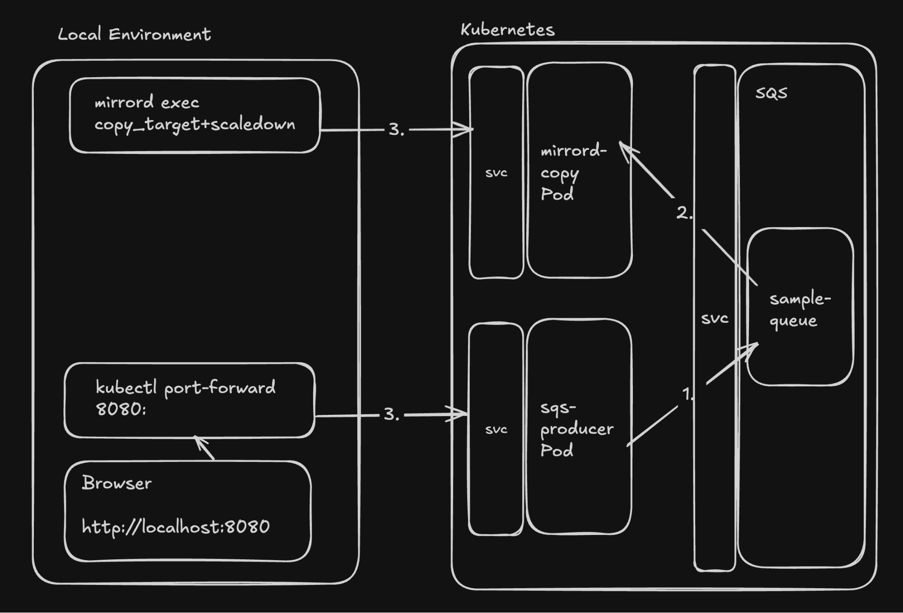
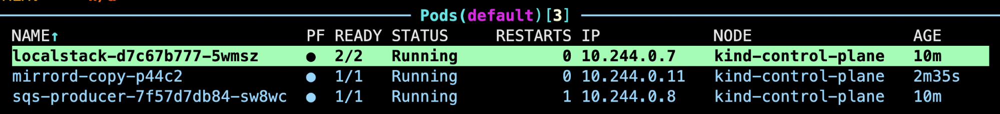
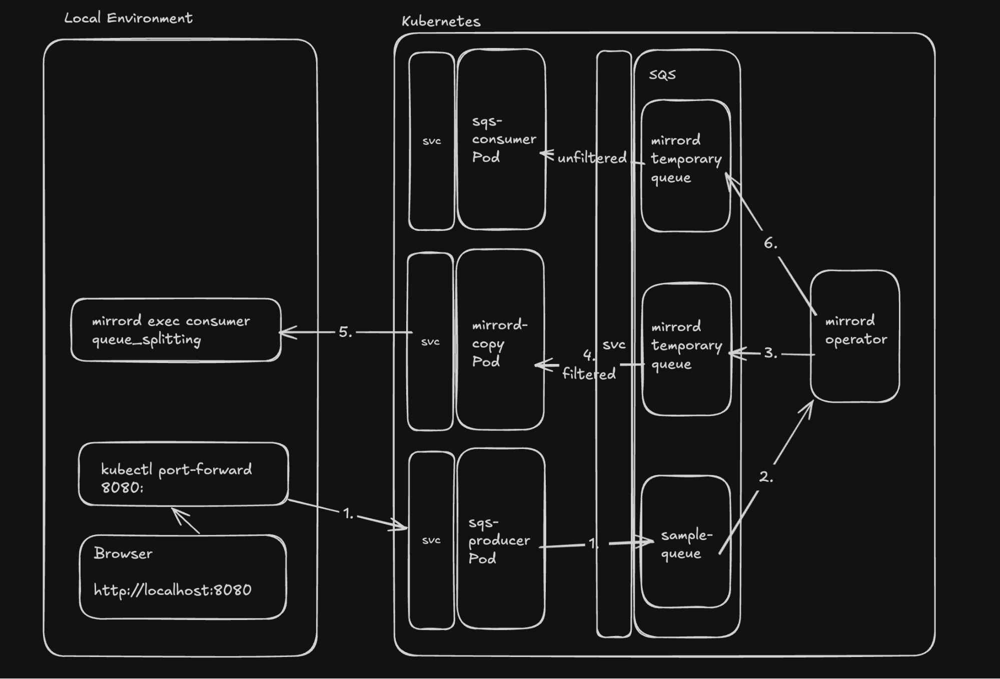
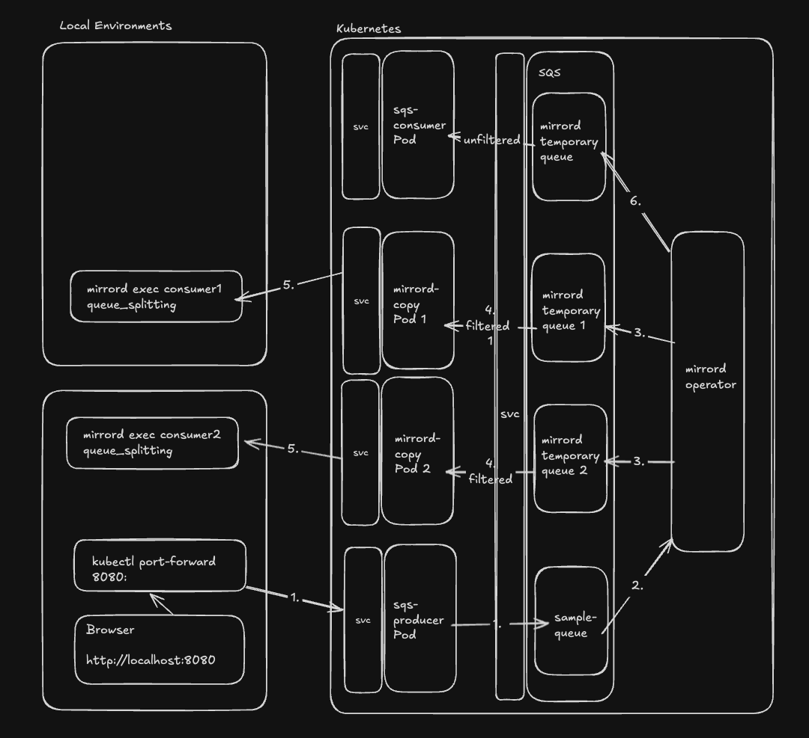
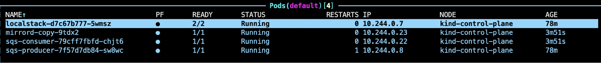

# How to Debug SQS Consumers

In this guide, we’ll cover how to debug SQS consumer applications running in a Kubernetes environment using mirrord. You’ll learn how to set up mirrord and use it to effectively debug SQS consumers without the traditional overhead of rebuilding and redeploying your application.

**Tip**: mirrord is a development tool which makes developing cloud applications significantly easier. If you're not familiar we'll recommend checking out the [getting started guide](https://metalbear.com/mirrord/docs/overview/quick-start/) first!

Debugging distributed applications, especially those that use messaging systems like Amazon SQS, can be challenging. These systems often span multiple services and depend on asynchronous communication patterns. Traditional debugging approaches can fall short when trying to trace issues across these complex systems.

Developers can debug cloud-native applications using mirrord by allowing local SQS consumer applications to access remote Kubernetes resources using context mirroring. Let’s go through some common debugging techniques to debug such applications to understand how using mirrord would help you save time and shorten the development feedback loop when working with SQS consumers.

## Common debugging techniques for SQS consumers

It can be cumbersome to debug SQS consumers on Kubernetes. The lack of a debugging workflow for applications with multiple runtime dependencies in the context of Kubernetes makes it even harder. Why is debugging SQS consumers in Kubernetes so challenging? Let’s look at the common approaches and their limitations:

### Continuous Deployment

Build a container image and deploy it to a Kubernetes cluster dedicated to testing or staging. The iterative process of building, deploying, and testing is resource-intensive and time-consuming, especially when you’re making frequent code changes to your SQS consumers.

### Log Analysis

One of the most common ways to understand SQS consumer behavior in a cluster is by analyzing logs. Adding extra logs to extract runtime information about message consumption, visibility timeouts, and processing is very common. While collecting and analyzing logs from different consumers can be effective, it isn’t the best real-time debugging solution, especially when trying to trace message flow through the system.

### Remote Debugging

Developers can use remote debugging tools built into IDEs to attach to SQS consumer processes already running in a Kubernetes cluster. While this allows real-time code inspection and interaction, it still requires heavy overhead from the IDE and a separate debug configuration for the deployment which can potentially affect the consumer’s performance while debugging.

The above methods can be used by themselves or they can be used together, but they all have significant drawbacks in terms of development speed and efficiency.

## Challenges of debugging SQS consumers in Kubernetes

Debugging SQS consumers effectively within a Kubernetes context is perhaps the biggest challenge of working with SQS in cloud environments. The build and release loop of the application can be short, but the process slows down development significantly. Nothing beats the ease and speed of debugging applications locally.

SQS consumers present unique challenges:

1. Message Visibility: SQS uses visibility timeouts to ensure messages are processed only once. Debugging can affect processing time, potentially causing message redelivery issues.

1. State Management: Consumers must properly delete messages after processing, and debugging can disrupt this state management, leading to missed or duplicate message processing.

1. Environment Dependencies: SQS consumers typically depend on specific configurations for queues, IAM permissions, and possibly DLQs that must be replicated in the debug environment.

1. Performance Implications: Debugging tools can introduce latency that may trigger visibility timeout issues that don’t exist in production.

1. Distributed Tracing: Following a message through the entire system from producer to consumer can be challenging without proper tooling.

These challenges make it essential to have a debugging approach that can seamlessly integrate with both local and remote SQS environments.

## Prerequisites

Before we dive into debugging SQS consumers with mirrord, ensure you have the following set up:

### Developer Environment

A Kubernetes cluster (you can use one of the following):

- kind (Kubernetes in Docker)
- minikube
- Remote cluster with proper access

Tools:

- kubectl CLI
- mirrord CLI
- helm (if using helm for mirrord operator installation)

## Installing mirrord

Install the mirrord CLI:

```bash
brew install metalbear-co/mirrord/mirrord
```

For alternative installation methods, please follow the [quick start guide](https://metalbear.com/mirrord/docs/overview/quick-start/).

## Installing mirrord operator

You can install the mirrord operator using either Helm or the mirrord CLI:

**Tip**: You can obtain a LICENSE key by visiting https://app.metalbear.com/. This key is required for installing the mirrord operator with queue splitting functionality.

### Using Helm:

```bash
# Add the MetalBear Helm repository
helm repo add metalbear https://metalbear-co.github.io/charts

# Install the mirrord operator with SQS splitting enabled
helm install --set license.key=your-license-key --set operator.sqsSplitting=true mirrord-operator metalbear/mirrord-operator
```

**Note**: When installing with the mirrord-operator Helm chart, queue splitting is enabled by setting the `operator.sqsSplitting` value to true.

### Or using the CLI:

```bash
mirrord operator setup --accept-tos --license-key your-license-key --sqs-splitting --aws-role-arn 12345 | kubectl apply -f -
```

We will also be using [LocalStack](https://github.com/localstack/localstack) instead of AWS to test out SQS. With that in mind, we would also like to have the operator localstack instead of AWS as well. Let’s update the environment variables in the operator with the following command to ensure that we override the AWS endpoint to our localstack instance which we shall deploy in the next section.

```bash
kubectl patch deployment mirrord-operator -n mirrord --patch-file patch/mirrord-operator-env.yaml
```

**Note**: This setup is only for demonstration purposes. In reality most likely you will be using this with actual Amazon SQS queues and not LocalStack.

## Sample application setup

### Overview of the sample application

Let’s explore how to debug SQS consumers using a simple example application. Our example consists of:

- An SQS queue (using LocalStack in local development)
- A producer service that publishes messages to an SQS queue
- A consumer service that reads messages from the same queue

**Note**: The sample application used in this guide is available [here](https://github.com/waveywaves/mirrord-sqs-debug-example). This guide is intended to be used alongside the repository, which contains all the code and configuration files needed to follow along.

The following architecture diagram shows the basic setup of our SQS application in Kubernetes without mirrord. It illustrates how the producer sends messages to the SQS queue, and how the consumer reads these messages in a standard deployment:



### Understanding the application components

**Producer (`sqs-producer` deployment):**

- Flask web application that publishes messages to an SQS queue
- Exposes an API endpoint for receiving message data
- Uses the boto3 Python library to interact with SQS

**Consumer (`sqs-consumer` deployment):**

- Flask web application that reads messages from the SQS queue
- Processes messages and exposes them in the logs
- Uses the boto3 Python library to interact with SQS

**SQS Configuration:**

- Queue name: `sample-queue`
- Local development uses LocalStack to emulate SQS

The applications are containerized and deployed to Kubernetes.

## Deploying the sample application

### Starting your Kubernetes cluster

We are going to use minikube as the Kubernetes environment in which we are going to deploy our sample application. Run the following command to start minikube locally.

```bash
minikube start
```

**Note**: We're only using a local cluster for this sample app and actually the idea is for developers to use mirrord with a staging/testing cluster where the app is already deployed.

### Applying Kubernetes manifests

Let’s start by deploying our example SQS application to Kubernetes:

```bash
kubectl apply -f kube/
```

After running this command, you’ll see output similar to this:



This deploys the LocalStack SQS emulator, producer, and consumer to your Kubernetes cluster. Once everything is up and running, we can proceed with debugging.

### Important SQS configuration values

#### SQS endpoint configuration

| Parameter             | Value                  | Description                       |
| --------------------- | ---------------------- | --------------------------------- |
| AWS_ENDPOINT_URL      | http://localstack:4566 | LocalStack SQS endpoint           |
| AWS_DEFAULT_REGION    | us-east-1              | AWS region for SQS                |
| AWS_ACCESS_KEY_ID     | test                   | Access key for LocalStack (dummy) |
| AWS_SECRET_ACCESS_KEY | test                   | Secret key for LocalStack (dummy) |
| QUEUE_NAME            | sample-queue           | Name of the SQS queue             |

#### Consumer configuration

| Parameter           | Value | Description                                          |
| ------------------- | ----- | ---------------------------------------------------- |
| MaxNumberOfMessages | 10    | Maximum number of messages to retrieve per poll      |
| WaitTimeSeconds     | 20    | Long polling time in seconds                         |
| VisibilityTimeout   | 30    | How long a message is invisible after being received |

## Debugging scenarios for SQS consumers

When debugging SQS consumers, you typically want:

- Full visibility into the message flow
- Ability to intercept messages without affecting production systems
- Reproducing issues locally with the same environment as production
- Access to queue metrics and visibility timeout information
- Low latency and real-time monitoring capabilities

mirrord helps create these ideal conditions by connecting your local development environment to your remote Kubernetes cluster. Let’s explore two debugging approaches which help us debug SQS queues.

## Debugging an SQS consumer with mirrord

### Using the SQS Producer UI to send messages to the consumer

Before we start debugging the consumer itself we need to know how to send messages to the SQS queue in question. This can be done by accessing the UI for the consumer using port forwarding. Running the following command will allow you to access your SQS Producer UI in the browser at `http://localhost:5000`

Access the UI using:

```bash
kubectl port-forward deployment/sqs-producer 5000:5000
```

Once you navigate here using your browser you should be able to access the producer UI.



Now that we know how to access the producer, let’s dive into two effective approaches for debugging SQS consumers with mirrord:

### Approach 1: Simple Debugging with copy_target + scaledown (easier to execute)

The simplest way to debug SQS consumers is to ensure your local consumer is the only one receiving messages from the queue. mirrord’s copy_target feature with scale_down enabled accomplishes this. For detailed documentation, see [mirrord’s copy target documentation](https://metalbear.com/mirrord/docs/using-mirrord/copy-target/#replacing-a-whole-deployment-using-scale_down).

```json
{
  "operator": true,
  "target": {
    "deployment": "sqs-consumer",
    "container": "consumer"
  },
  "feature": {
    "copy_target": {
      "scale_down": true
    }
  }
}
```

This configuration:

1. Targets the sqs-consumer deployment
2. Creates a copy of the deployment’s pod
3. Scales down the original deployment to zero replicas 4. Ensures your local application receives all the messages

This approach is illustrated in the following diagram:



1. Here the sqs-producer sends messages to the sample-queue.

1. Which is then picked up by the mirrord-copy Pod which has scaled the consumer Pod down and is going to relay the message to our local consumer.

1. The local mirrord based execution of the consumer application receives this. Messages can be created and sent from the UI.

Now that we understand how this works, let’s use this configuration locally.

#### How to use this configuration

The configuration is located in a file named .mirrord/copytarget_plus_scaledown.json. Use this configuration to run the consumer application locally with the following command:

```bash
APP_MODE=consumer PYTHONUNBUFFERED=1 mirrord exec --config .mirrord/copytarget_plus_scaledown.json -- python app.py
```

When you run this command, you can use the producer to send messages which will then be picked up by your local consumer after which, you’ll see output similar to:



**Tip**: This approach is perfect for isolated debugging, but be aware that it temporarily stops the original consumer from processing messages. Use it in development or testing environments rather than production.

### Approach 2: Queue Splitting for non-disruptive debugging

Queue splitting is a powerful feature in mirrord that allows both your local application and the remote application to receive the same messages. This is particularly useful when you want to debug without disrupting the existing remote consumers. For detailed documentation on queue splitting, visit https://metalbear.com/mirrord/docs/using-mirrord/queue-splitting/.

#### How queue splitting works

Before we get into how to use queue splitting, let’s go through the following diagrams to illustrate how queue splitting works in mirrord.

Initial setup with the mirrord operator intercepting messages:



The mirrord operator intercepts messages at the SQS API level before they are delivered to consumers. It makes copies of these messages and delivers them to both the remote consumers and your local application.

This works by:

1. The mirrord operator understands the SQS protocol
2. It identifies messages being sent to specific queues
3. It duplicates these messages, sending the original to the real consumers and copies to your local application

When multiple debug consumers are active, the mirrord operator creates temporary queues for each one. Each developer gets their own independent debug session with access to the message stream.

In case of multiple debug consumers, a new temporary mirrord queue and mirrord-copy Pod is created for every new debug consumer.



mirrord allows multiple debug consumers to run simultaneously. Each developer can run their own local consumer, and all will receive copies of the same messages. The mirrord operator also ensures that each local debug consumer gets a complete copy of the message stream, without any competition between them or with the production consumers.

**Tip**: This means your entire team can debug the same SQS consumer application simultaneously without interfering with each other or with production traffic! This team collaboration capability is a feature of [mirrord for Teams](https://metalbear.com/mirrord/docs/overview/teams/).

#### Configuration for queue splitting

For queue splitting to work, you need to have a local and a remote configuration for debugging your SQS based application. The local configuration is used by the CLI and the remote configuration contains CRDs which are used by the operator to get more information on the SQS instance and the queues to be intercepted.

##### Local mirrord configuration

The queue splitting configuration can be found in the `.mirrord/mirrord.json` file and has the following content:

```json
{
  "operator": true,
  "target": {
    "deployment": "sqs-consumer",
    "container": "consumer"
  },
  "feature": {
    "split_queues": {
      "sample_queue": {
        "queue_type": "SQS",
        "message_filter": {
          "local": "1"
        }
      }
    }
  }
}
```

This configuration tells the local mirrord client:

- The SQS queue to listen to (`sample_queue`)
- To filter messages based on a pattern (the `local` message attribute key to have a value of 1)
- Which deployment to target (`sqs-consumer`)

##### Operator Configuration:

The mirrord operator needs information about the SQS setup. This is configured using Kubernetes custom resources.

First, create a `MirrordWorkloadQueueRegistry` resource:

```yaml
apiVersion: queues.mirrord.metalbear.co/v1alpha
kind: MirrordWorkloadQueueRegistry
metadata:
  name: consumer-queue-registry
  namespace: default
spec:
  queues:
    sample-queue:
      queueType: SQS
      nameSource:
        envVar: QUEUE_NAME
      tags:
        tool: mirrord
  consumer:
    name: sqs-consumer
    container: consumer
    workloadType: Deployment
```

Apply these configurations to your cluster:

```bash
kubectl apply -f kube/
```

#### Running your local consumer with queue splitting

Now you can run your local application with mirrord using queue splitting:

```bash
mirrord exec -f .mirrord/mirrord.json -- python sqs_consumer.py
```

**Tip**: You can use message filters to focus on specific patterns of messages, making debugging more targeted.

After running with queue splitting and specific message filtering, you can produce messages with or without the necessary filter from the producer UI. You can access the producer UI at `https://localhost:8081` after running the following command:

```bash
kubectl port-forward service/sqs-producer 8081:
```

Once both the local debug `sqs_consumer` and the producer UI are accessible. Let’s send some messages to see if the filtering works.


After sending some messages with the required message attribute for filtering and some without, we can see in the debug sqs_consumer instance that the filtering indeed works.

You’ll see that both the consumer and the copy Pod are available ensuring that the original consumer doesn’t stop consuming the messages whereas the copy Pods will received the filtered messages:



Similarly multiple debug consumers can consume these messages without disrupting the original consumer by creating more copy Pods and temporary mirrord queues as required.

Here, each instance creates its own mirrord-copy pod and receives the same messages, demonstrating how multiple developers can debug simultaneously. Notice in the second screenshot how multiple debug consumers are actively receiving messages in parallel. This collaborative debugging is made possible by [mirrord for Teams](https://metalbear.com/mirrord/docs/overview/teams/), which enables concurrent use of mirrord on the same environment.

## Debugging with mirrord vs. other techniques

mirrord distinguishes itself by eliminating the need for repeated building and deployment cycles. It allows you to run your SQS consumer locally while providing it with the necessary network and execution context of the target Kubernetes environment. Your local consumer behaves as if it were running within the cluster, enabling you to debug using familiar tools without the overhead of build and deploy cycles.

## Conclusion

In this guide, we’ve explored how to use mirrord to debug SQS consumer applications in Kubernetes. We’ve seen two powerful approaches:

1. **Queue splitting** allows you to debug without disrupting existing consumers by duplicating messages. Learn more about this feature in the [queue splitting documentation](https://metalbear.com/mirrord/docs/using-mirrord/queue-splitting/).

1. **Copy target with scale down** gives your local application exclusive access to SQS messages. Learn more in the [copy target documentation](https://metalbear.com/mirrord/docs/using-mirrord/copy-target/#replacing-a-whole-deployment-using-scale_down).

By leveraging mirrord, you can significantly improve your productivity when working with SQS consumer applications and streamline your debugging workflow. For teams working together on SQS applications, [mirrord for Teams](https://metalbear.com/mirrord/docs/overview/teams/) provides additional collaborative features that enable multiple developers to debug simultaneously.

Curious to try it out? Give mirrord a go and see how it works for you. Got questions? Visit the [mirrord documentation](https://metalbear.com/mirrord/docs/) or join the community [Slack](https://metalbear.com/slack) channel!
