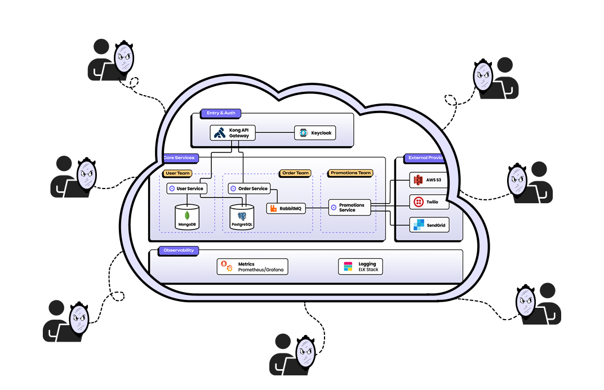

## TL;DR

- monday.com was spending heavily on **per-developer cloud environments** that took 30+ minutes to spin up and 3–5 days for new hires to learn how to wrangle
- After adopting mirrord, **245+ engineers** now work concurrently on a single shared staging cluster — reducing environment setup to seconds and new developer onboarding to under an hour
- **Dev environment cloud costs dropped to zero**, developer satisfaction increased significantly, and teams eliminated cross-team dependency bottlenecks



## The challenge: Per-developer environments that couldn't keep up with hypergrowth

monday.com's engineering org grows **30–60% year over year**. A few years ago they had around 30 services. Today they have **hundreds** — and every developer needed their own copy of the full environment to work.

The team started with Docker Compose, but as the system grew, not everything could fit on personal machines. They moved to dedicated per-developer cloud environments — each developer getting their own full copy of the system in the cloud.

With **1,000+ developers** and **400+ microservices**, the math was unsustainable. Every new hire meant another full environment to provision and maintain. Setup took **30 minutes to several hours**, new hires spent **3–5 days** just learning how to wrangle their environments, and the cloud bill for dev environments alone was massive.

The team called the defining pain point **"domains leaking."** Because each developer had to deploy services owned by every other team, any issue in someone else's code would break your environment. Developers spent their time chasing other teams instead of writing code, and DevOps was stuck playing intermediary.

After six months of optimization effort, the minimum number of services each developer needed had **doubled**. It wasn't going to scale.

## The solution: One shared environment for everyone

The DevEx team researched the request isolation pattern and evaluated several tools including Telepresence. mirrord offered what they needed: **a way for all developers to share the existing staging environment** without interfering with each other.

The rollout was deliberate — starting with **40 alpha users**, then expanding environment by environment, tracking wake-up time, feedback loop latency, and PR throughput. Domain leaking **disappeared immediately**. The DevOps team stopped firefighting cross-team dependency issues and could focus on onboarding new services to the shared model.

> "Before mirrord, a lot of developers were afraid of setting up their local development setup. I think mirrord removed that fear."
>
> — Shahar Golan, DevOps Engineer, Distribution Infra

<!-- TODO: Add monday-shahar-golan.mp4 to static/ when ready -->


For developers, the change was immediate. No more spending 30 minutes to four hours setting up a local environment. No more discovering that your environment drifted from production only after deploying. No more getting tagged the morning after a release because a bug slipped through that your local setup couldn't catch.

With mirrord, developers work against **a real staging environment with real data** — already configured, already running, already matching production. Features that previously took days or a week to ship now go out in **a day or two**. And because the environment is always ready, even short windows between meetings became productive coding time.

> "When I'm working with mirrord, I don't have to compromise between speed and confidence — I get both."
>
> — Giora Guttseit, Software Engineer, CRM Group

<!-- TODO: Add monday-giora-guttseit.mp4 to static/ when ready -->


What started as a careful rollout became organic adoption. Nobody had to be convinced — developers saw what mirrord did for their colleagues and asked for access themselves. Today, **245+ engineers** work concurrently on the same shared cluster, CI end-to-end test runtime has dropped by **~50%**, and the teams that used to manage per-developer environments have been freed up entirely.
